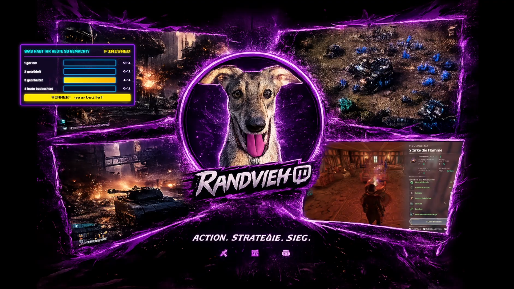
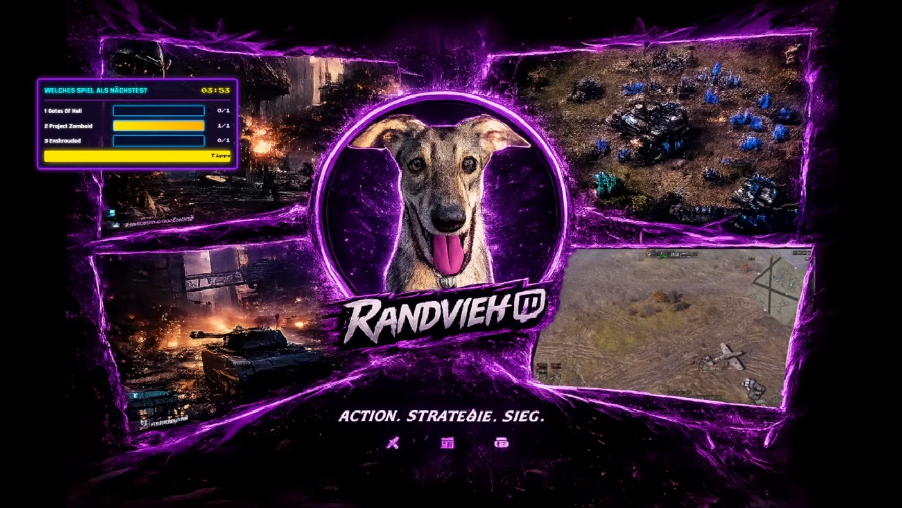
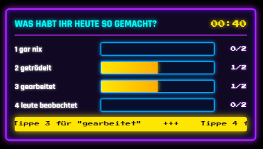
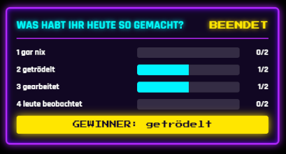
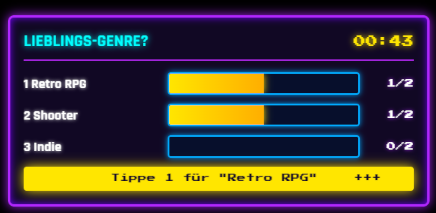
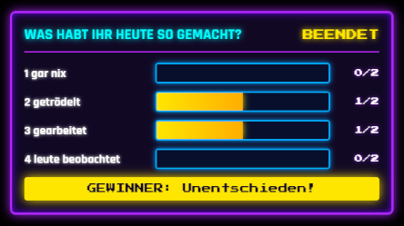

# Streamer.bot Retro Poll Overlay (German version below)

A custom, interactive poll system designed for **Streamer.bot** (v1.0.7+) and **OBS Studio** with a retro aesthetic.

## Features
- **Flexible Polls**: Highly customizable with up to 10 voting options.
- **Full Chat Control**: Create, start, pause, resume, reset, and adjust remaining time using simple chat commands.
- **Smart Chat Voting**: Viewers vote by sending option numbers (`1`, `2`, etc.). Out-of-bounds numbers are ignored, and double-voting is prevented.
- **Smart Winner Handling**: Built-in tie detection ("Draw!") and fallback handling for 0-vote scenarios ("No Result").
- **Animated Ticker**: Dynamic marquee ticker at the bottom explaining how to submit votes in chat.

## Video

## Screenshots

  
  
  
  
  
  

## Commands (Moderator / Broadcaster)

| Command | Description |
| :--- | :--- |
| `!poll 10m "Title" "Opt 1" "Opt 2"` | Prepares a poll with duration (e.g., 10m, 90s) |
| `!poll start` | Starts the prepared poll |
| `!poll pause` | Pauses the timer |
| `!poll resume` | Resumes the timer |
| `!poll restart` | Resets and restarts the poll with all existing options |
| `!poll +2m` / `!poll -1m` | Adjusts remaining time during an active poll |
| `!poll end` | Ends the poll early and announces the final result |

## Setup Instructions

### 1. File Placement
1. Create the directory `C:\Streaming\poll\`.
2. Save the `overlay/poll_overlay.html` file into `C:\Streaming\poll\poll_overlay.html`.

### 2. Streamer.bot Setup
1. Create a new Action named `Poll Core Manager`.
2. Add a C# Subaction: `Core -> C# -> Execute C# Code`.
3. Paste the code from `streamerbot/PollManager.cpp` into the subaction and compile it.
4. Create two triggers under **Commands**:
   - `!poll` $\rightarrow$ Link trigger to the `Poll Core Manager` action (`Command Triggered: !poll`).
   - `Poll Vote` with lines `1` through `10` $\rightarrow$ Link trigger to the same action.

### 3. OBS Studio
1. Add a new **Browser Source**.
2. Check **Local file** and select `C:\Streaming\poll\poll_overlay.html`.
3. Set the dimensions to **600 x 800** px.

## License
MIT License - See [LICENSE](LICENSE) for details.

## Contact

**Marc-Oliver Blumenauer**  
Email: [marc@l3c.de](mailto:marc@l3c.de)

If you want to get me a cup of coffee I appreciate: 

# Streamer.bot Retro Poll Overlay

Ein maßgeschneidertes, interaktives Poll-System für **Streamer.bot** (v1.0.7+) und **OBS Studio** im Retro Look.

## Features
- **Flexible Polls**: Bis zu 10 Wahloptionen frei konfigurierbar.
- **Volle Chat-Steuerung**: Erstellen, Starten, Pausieren, Fortsetzen, Zurücksetzen und Anpassen der Restzeit via Chat-Befehlen.
- **Auto-Verstärkung im Chat**: Chatter stimmen durch einfache Zahlen (`1`, `2`, ...) ab. Ungültige Zahlen werden ignoriert, Doppel-Abstimmungen verhindert.
- **Smart Winner Handling**: Automatische Erkennung von Gleichständen ("Unentschieden!") sowie "Kein Ergebnis" bei 0 Stimmen.
- **Animation & Marquee**: Dynamischer Lauftext zur Erklärung der Stimmabgabe im unteren Bereich des Overlays.

## Video

## Screenshots

  
  
  
  
  
  

## Befehle (Moderator / Broadcaster)

| Befehl | Beschreibung |
| :--- | :--- |
| `!poll 10m "Titel" "Opt 1" "Opt 2"` | Vorbereitung einer Umfrage mit Dauer (z. B. 10m, 90s) |
| `!poll start` | Umfrage starten |
| `!poll pause` | Timer pausieren |
| `!poll resume` | Timer fortsetzen |
| `!poll restart` | Umfrage mit allen Optionen zurücksetzen und neu starten |
| `!poll +2m` / `!poll -1m` | Restzeit im laufenden Poll anpassen |
| `!poll end` | Poll vorzeitig beenden und Ergebnis ausgeben |

## Einrichtung

### 1. Dateien ablegen
1. Erstelle den Ordner `C:\Streaming\poll\`.
2. Speichere die Datei `overlay/poll_overlay_de.html` in `C:\Streaming\poll\poll_overlay_de.html`.

### 2. Streamer.bot einrichten
1. Erstelle eine neue Action: `Poll Core Manager`.
2. Füge eine C#-Subaction hinzu: `Core -> C# -> Execute C# Code`.
3. Kopiere den Code aus `streamerbot/PollManager_de.cpp` in die Subaction und kompiliere ihn.
4. Erstelle zwei Commands unter **Commands**:
   - `!poll` $\rightarrow$ Trigger in der Action verknüpfen (`Command Triggered: !poll`).
   - `Poll Vote` mit den Zeilen `1` bis `10` $\rightarrow$ Trigger in derselben Action verknüpfen.

### 3. OBS Studio
1. Füge eine neue **Browserquelle** hinzu.
2. Aktiviere **Lokale Datei** und wähle `C:\Streaming\poll\poll_overlay_de.html`.
3. Setze die Dimensionen auf **600 x 800** px.

## License
MIT License - Siehe [LICENSE](LICENSE) für Details.

## Contact

**Marc-Oliver Blumenauer**  
Email: [marc@l3c.de](mailto:marc@l3c.de)

If you want to get me a cup of coffee I appreciate: 

